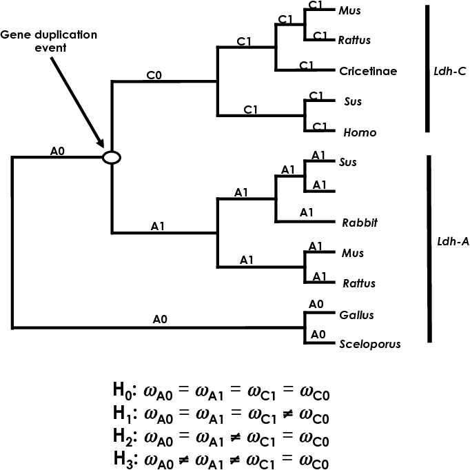

# Testing for selection using PAML

## Online Resources

- Tutorial: http://www.molecularevolution.org/resources/activities/paml_activity
- PAML software: http://abacus.gene.ucl.ac.uk/software/paml.html
- Chi$^2$ calculator: http://www.di-mgt.com.au/chisquare-calculator.html

The objective of this activity is to help you understand how to use different codon models, and how to test for selection using PAML, and specifically the CODEML program.

## Download and compile PAML

```bash
cd /global/work/kursXY
mkdir PAML
cd PAML
wget http://abacus.gene.ucl.ac.uk/software/paml4.9c.tgz
tar -zxvf paml4.9c.tgz 
cd paml4.9c/src
make
cp codeml ../../
cd ../../
rm -R paml*
```

## Download data files for exercises

```bash
wget https://github.com/tonig-evo/workshop-paml/raw/master/paml_material.zip
unzip paml_material.zip 
```

Please also download the materials folder to your local computer to be able to view the PDFs.

# Exercises

## Maximum Likelihood estimation of $d_N/d_S$ ratio

The objective of this activity is to use CODEML to evaluate the likelihood of the GstD1 sequences for a variety of $\omega$ values. Plot log-likelihood scores against the values of $\omega$ and determine the maximum likelihood estimate of $\omega$. Check your finding by running CODEML’s hill-climbing algorithm.

1. Find the files for this exercise in the paml_material folder (paml_gstd1_codeml.ctl.ex1.txt, paml_gstd1_seqfile.txt) and familiarize yourself with them. When you are ready to run CODEML, rename the file paml_gstd1_codeml.ctl.ex1.txt, as this control file must be called **codeml.ctl**.
2. Create a directory where you want your results to go, and place all your files within it. Now open a terminal, move to the directory that contains your files, and run CODEML.

```bash
mkdir exercise1
cp paml_material/paml_gstd1_codeml.ctl.ex1.txt exercise1/codeml.ctl
cp paml_material/paml_gstd1_seqfile.txt exercise1/seqfile.txt
cp codeml exercise1/
cd exercise1
./codeml
```

3. Familiarize yourself with the results (results.txt, paml_material/ex1_HelpFile.pdf). If you have not edited the control file the results will be written to a file called results.txt. Identify the line within the results file that gives the likelihood score for the example dataset.
4. Now change the control files (e.g. with nano) and re-run CODEML. The objective is to compute the likelihood of the example dataset given a fixed value of omega.
5. Change the name of your result file (via outfile= in the control file) or you will overwrite your previous results!
6. Change the fixed value for omega by changing the value for omega= in the control file. The values for this exercise are provided as comments at the bottom of the example control file that has been provided to you.
7. Repeat step 4 for each value of omega given in the comments of the example control file.
8. Use your favorite spread sheet or statistical package to plot the likelihood score (y-axis) against the fixed value for omega (x-axis). Use a logarithmic scale for the x-axis.
9. From the plot, try to guess the value of omega that will maximize the likelihood score (i.e., the MLE).
10. Now change the control file so that CODEML will use its hill-climbing algorithm to find the MLE; set fix_omega=0 in the control file. Compare the result to your guess from step 7.

## Sensitivity of the dN/dS ratio to assumptions

In this exercise you will investigate the sensitivity of your estimate of $\omega$ to the transition/transversion ratio ($\kappa$), and to the assumed model for codon frequencies ($\pi$i’s). After you collect the required data you will determine which assumptions yield the largest and smallest values of S, and what is the effect on $\omega$.

1. Find the files for exercise 2 in the **paml_material** folder (ex2_codeml.ctl, paml_gstd1_seqfile.txt) and familiarize yourself with them. Create a new directory for exercise 2, and copy the necessary files into that directory accordingly.
2. Run CODEML using the settings in the control file for exercise 2. Familiarize yourself with the results (ex2_HelpFile.pdf). In addition to the likelihood score you must be able to identify the part of the result file that provides estimates of the following:
    - Number of synonymous or nonsynonymous sites (S and N)
    - Synonymous and nonsynonymous rates (dS and dN)
3. As in exercise 1, you will need to change the control files and re-run CODEML. The objective is to compute the likelihood of the example dataset under different model assumptions. To do this you must:
    - Change the name of the main result file (via outfile= in the control file) or you will overwrite your previous results
    - Change the model assumptions about codon frequencies (via CodonFreq=) and kappa (via kappa= and fix_kappa=).
4. Repeat step 3 for each set of assumptions about codon frequencies and kappa given as comments at the bottom of the example control file.
5. In your favorite spreadsheet program create a table like “Table E2” in the slides (tableE2.pdf) and fill it in with your results.
6. Use your table to determine which assumptions yield the largest and smallest values of S. What is the effect on omega?

## Testing hypotheses about molecular evolution of LDH

The objective of this exercise is to use three LRTs to evaluate the following hypotheses: (1) the mutation rate of Ldh-C has increased relative to Ldh-A, (2) a burst of positive selection for functional divergence occurred following the duplication event that gave rise to Ldh-C, and (3) there was a long term shift in selective constraints following the duplication event that gave rise to Ldh-C.

1. Obtain the files for Exercise 3 from the **paml_material** folder (paml_ldh_codeml.ctl.txt, paml_ldh_seqfile.txt, paml_ldh_tree.H0.txt, paml_ldh_tree.H1.txt, paml_ldh_tree.H2.txt, paml_ldh_tree.H3.txt). The tree files represent different hypotheses denoted H0, H1, H2 & H3 (LDH_tree.pdf, Figure 1). These hypotheses represent the following concepts:
    - H0: homogeneous selection pressure over the tree
    - H1: episodic change in selection pressure in Ldh-C (only in the branch that immediately follows the gene duplication event).
    - H2: Long term shift in selection pressure in Ldh-C only; Ldh-C has a permanent change in selection pressure (as compared to its ancestors) whereas Ldh-A remains subject to the ancestral level of selection pressure.
    - H3: Long term shift in selection on both Ldh-C and Ldh-A; those lineages are subject to selection pressures different from each other and from the ancestor.
2. Run CODEML using the settings in the control file for Exercise 3. Familiarize yourself with the results (ex3_HelpFile.pdf). In addition to the likelihood score you must be able to identify the branch-specific estimates of the omega parameter. (In the first run, the branch specific values for omega will all be the same. In later runs there will be differences among some branches).
3. As in the previous exercises, you will need to change the control files and re-run CODEML. The objective is to compute the likelihood, and estimate omega parameters, under different models of how selection pressure changes in different parts of the tree. Because the relevant model information is contained in the tree file, you will need several tree files (obtained from the course web site) and change the control file so that it reads the different tree files.
    - As always, you should change the name of the main result file (via outfile= in the control file) or you will overwrite your previous results.
    - Change the model assumptions about branch specific omega values by changing the tree files (via treefile= and model=) set within the control file.
4. Repeat step 3 for each of the four tree files that have been provided to you. Again, keep track of your results by using a table like “Table E3” shown in the slides (tableE3.pdf). In addition, carry out likelihood ratio tests (LRT) of the hypotheses below. Use 1 degree of freedom for each LRT. Helpful: Chi-Square Calculator.
    - H0 vs. H1
    - H0 vs. H2
    - H2 vs. H3
5. Design your own alternative hypothesis H4 that you find reasonable to test in this framework. Conduct the appropriate test with PAML and note the key statistics.



## Testing for adaptive evolution in the nef gene of human HIV-2

The objective of this exercise is to use a series of LRTs to test for sites evolving under positive selection in the nef gene. If you find significant evidence for positive selection, then identify the involved sites by using empirical Bayes methods.

1. Obtain all the files for exercise 4 from the course website (ex4.codeml.ctl, paml_hiv2nef_seqfile.txt, treefile_M0.txt, treefile_M1.txt, treefile_M2.txt, treefile_M3.txt, treefile_M7.txt, treefile_M8.txt).
2. If you plan to run two or more models at the same time, then create a separate directory for each run and place a sequence file, control file and tree file in each one.
3. As in all the previous exercises, you will need to change the control file and re-run CODEML several times. In this case you will be fitting six different codon models (M0, M1a, M2a, M3, M7 & M8) to the example dataset.
    - If you are running your analyses sequentially in the same directory, then you should change the name of the main result file (via outfile= in the control file) or you will overwrite your previous results.
    - Set the tree file with treefile=. I have supplied tree files pre-loaded with the ML branch lengths for each model (hence you need to set a different tree for each model). This will greatly speed up your analyses, giving you more “beer time”. See the example control file for more details about treefile names.
    - Set the codon model with NSsites=.
    - Fix the value of kappa at the ML estimate with kappa=. Again, this will help speed up the analysis. See the control file for the value of kappa for each model.
        For some models you will also need to set the number of categories (ncatG) in the omega distribution:
          - For M3 set ncatG=3
          - For M7 set ncatG=10
          - For M8 set ncatG=10
    - Once the analysis is complete, rename the rst file because subsequent runs will overwrite it!
    - Repeat steps a. through f. for each of the six codon models listed above.
4. Keep track of your results (ex4_HelpFile.pdf) by using a table like “Table E4” shown in the slides (tableE4.pdf).
5. In addition, carry out the following likelihood ratio tests:
    - M0 vs. M3 (4 degrees of freedom)
    - M1a vs. M2a (2 degrees of freedom)
    - M7 vs. M8 (2 degrees of freedom)
6. Lastly, open the rst file generated when you ran model M3 (ex4_rst_HelpFile.pdf). Locate the columns of posterior probabilities for each site under the three site-categories of this model. Use these data to reproduce the plot shown in the slides.

## Partioning model of PAML

Codeml implements a partioning model that is described in [Yang and Swanson, 2002](mbev_19_01_0049.pdf). Please also look at the PAML manual.

1. Read the manuscript by Yang and Swanson and answer the following questions:
    - What is the motivation of Yang and Swanson to implement a partioned model
    - What is the difference between a partioned model (fixed-site model) and site specific model with two site classes (random sites model)
    - How do the authors test the power of the partioning model?
    - What do they conclude from their results regarding the partioning model?

2. Run the model using the example files provided in the paml directory (examples/lysin)
    - Compare the likihoods of 
    
        (1) A non-partioned model (one omega)
        (2) A partioned model
        (3) A site specific model with two site classes
        (4) A site specific model with three site classes

3. Randomly assign a partioning of data to the dataset (examples/lysin)
    - Run 100 different randomly assigned partitions (using the same number of partioned postions as in the original dataset)
    - Plot a histogram of the obtained likelihoods and indicate the original likelihood value
    - What is your conclusion on how well the initial classification reflected heterogenity of the evolutionary rates across classified sites?

4. What biological "classifications" would be possible for a fixed site-model. Name at least 5 and discuss them briefly (Hint, you can choose maximum two examples for non-coding DNA)

5. How could a fixed-site model contribute to an ecological research question (reflect to your own resarch project).
